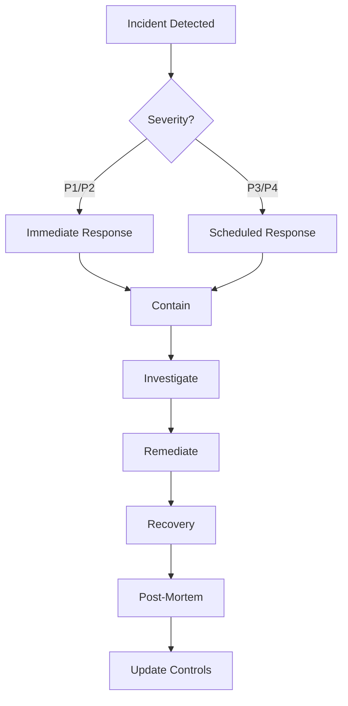
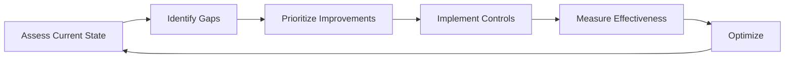

# Universal Security Compliance Framework
## SOC2 & ISO 27001 Implementation Guide

### Table of Contents
1. [Executive Summary](#executive-summary)
2. [Compliance Overview](#compliance-overview)
3. [Security Controls Framework](#security-controls-framework)
4. [Implementation Phases](#implementation-phases)
5. [Technical Requirements](#technical-requirements)
6. [Operational Requirements](#operational-requirements)
7. [Monitoring & Auditing](#monitoring--auditing)
8. [Incident Response](#incident-response)
9. [Compliance Checklist](#compliance-checklist)

---

## Executive Summary

This framework provides a comprehensive approach to achieving SOC2 Type II and ISO 27001 compliance for web applications. It addresses both technical and operational security requirements necessary for protecting user data and maintaining security standards.

### Key Compliance Standards

**SOC2 Type II** - Focuses on five Trust Service Criteria:
- Security
- Availability
- Processing Integrity
- Confidentiality
- Privacy

**ISO 27001** - Information Security Management System (ISMS) covering:
- Risk management
- Asset management
- Access control
- Cryptography
- Physical security
- Operations security
- Communications security

---

## Compliance Overview

### Regulatory Scope

| Standard | Focus Area | Audit Frequency | Certification Required |
|----------|------------|-----------------|----------------------|
| SOC2 Type II | Trust Services | Annual | Yes |
| ISO 27001 | ISMS | Annual | Yes |
| GDPR | Data Protection | Ongoing | No |
| PCI DSS | Payment Security | Annual | If processing cards |
| HIPAA | Healthcare Data | Ongoing | If handling PHI |

### Risk Categories

1. **Critical** - Immediate implementation required
2. **High** - Implementation within 30 days
3. **Medium** - Implementation within 90 days
4. **Low** - Implementation within 180 days

---

## Security Controls Framework

### 1. Access Control (Critical)

#### 1.1 Authentication
```javascript
// Required Implementation
- Multi-factor authentication (MFA)
- Strong password policy (min 12 chars, complexity)
- Account lockout after 5 failed attempts
- Session timeout after 30 minutes of inactivity
- Secure password storage (bcrypt/argon2)
```

#### 1.2 Authorization
```javascript
// Role-Based Access Control (RBAC)
const roles = {
  superAdmin: ['all:*'],
  admin: ['users:*', 'content:*', 'reports:read'],
  user: ['profile:*', 'content:read'],
  guest: ['content:read']
}
```

#### 1.3 Implementation Example
```typescript
// middleware/auth.ts
import { NextRequest, NextResponse } from 'next/server'
import jwt from 'jsonwebtoken'

export async function authMiddleware(req: NextRequest) {
  const token = req.headers.get('authorization')?.split(' ')[1]
  
  if (!token) {
    return NextResponse.json({ error: 'Unauthorized' }, { status: 401 })
  }
  
  try {
    const decoded = jwt.verify(token, process.env.JWT_SECRET!)
    // Validate permissions
    return NextResponse.next()
  } catch (error) {
    return NextResponse.json({ error: 'Invalid token' }, { status: 403 })
  }
}
```

### 2. Data Protection (Critical)

#### 2.1 Encryption Requirements
```yaml
At Rest:
  - Database: AES-256 encryption
  - File Storage: AES-256 encryption
  - Backups: Encrypted with separate keys
  
In Transit:
  - TLS 1.3 minimum
  - HSTS enabled
  - Certificate pinning for mobile apps
  
Key Management:
  - Separate key storage (AWS KMS, HashiCorp Vault)
  - Key rotation every 90 days
  - Split knowledge for master keys
```

#### 2.2 Data Classification
```javascript
const dataClassification = {
  public: {
    encryption: 'optional',
    retention: '5 years',
    access: 'unrestricted'
  },
  internal: {
    encryption: 'required',
    retention: '3 years',
    access: 'authenticated users'
  },
  confidential: {
    encryption: 'required',
    retention: '7 years',
    access: 'authorized users only'
  },
  restricted: {
    encryption: 'required',
    retention: 'legal requirement',
    access: 'need-to-know basis'
  }
}
```

### 3. Network Security (High)

#### 3.1 Security Headers
```javascript
// middleware/security.ts
export function securityHeaders(req, res, next) {
  // HSTS
  res.setHeader('Strict-Transport-Security', 'max-age=31536000; includeSubDomains; preload')
  
  // CSP
  res.setHeader('Content-Security-Policy', 
    "default-src 'self'; " +
    "script-src 'self' 'unsafe-inline' https://trusted-cdn.com; " +
    "style-src 'self' 'unsafe-inline'; " +
    "img-src 'self' data: https:; " +
    "font-src 'self' data:; " +
    "connect-src 'self' https://api.example.com; " +
    "frame-ancestors 'none'; " +
    "base-uri 'self'; " +
    "form-action 'self'"
  )
  
  // Other security headers
  res.setHeader('X-Content-Type-Options', 'nosniff')
  res.setHeader('X-Frame-Options', 'DENY')
  res.setHeader('X-XSS-Protection', '1; mode=block')
  res.setHeader('Referrer-Policy', 'strict-origin-when-cross-origin')
  res.setHeader('Permissions-Policy', 'geolocation=(), microphone=(), camera=()')
  
  next()
}
```

#### 3.2 WAF Configuration
```yaml
Web Application Firewall Rules:
  - SQL Injection Protection
  - XSS Protection
  - CSRF Protection
  - Rate Limiting (100 req/min per IP)
  - DDoS Protection
  - Bot Protection
  - Geographic Restrictions (if applicable)
```

### 4. Application Security (High)

#### 4.1 Input Validation
```typescript
// utils/validation.ts
import { z } from 'zod'
import DOMPurify from 'isomorphic-dompurify'

// Input sanitization
export function sanitizeInput(input: string): string {
  return DOMPurify.sanitize(input, {
    ALLOWED_TAGS: [],
    ALLOWED_ATTR: []
  })
}

// Schema validation
export const userSchema = z.object({
  email: z.string().email().max(255),
  name: z.string().min(1).max(100).transform(sanitizeInput),
  age: z.number().min(0).max(120),
  role: z.enum(['user', 'admin'])
})
```

#### 4.2 CSRF Protection
```typescript
// middleware/csrf.ts
import { createHash, randomBytes } from 'crypto'

export function generateCSRFToken(sessionId: string): string {
  const secret = process.env.CSRF_SECRET!
  const token = randomBytes(32).toString('hex')
  const hash = createHash('sha256')
    .update(sessionId + secret + token)
    .digest('hex')
  return `${token}.${hash}`
}

export function validateCSRFToken(token: string, sessionId: string): boolean {
  const [tokenPart, hashPart] = token.split('.')
  const secret = process.env.CSRF_SECRET!
  const expectedHash = createHash('sha256')
    .update(sessionId + secret + tokenPart)
    .digest('hex')
  return hashPart === expectedHash
}
```

### 5. Logging & Monitoring (Critical)

#### 5.1 Audit Logging
```typescript
// utils/audit.ts
interface AuditLog {
  timestamp: Date
  userId: string
  action: string
  resource: string
  ipAddress: string
  userAgent: string
  result: 'success' | 'failure'
  metadata?: Record<string, any>
}

export async function logAuditEvent(event: AuditLog) {
  // Log to secure, immutable storage
  await auditDatabase.insert({
    ...event,
    hash: generateHash(event) // For integrity verification
  })
  
  // Alert on critical events
  if (isCriticalEvent(event)) {
    await alertSecurityTeam(event)
  }
}
```

#### 5.2 Required Audit Events
```yaml
Authentication:
  - Login attempts (success/failure)
  - Logout events
  - Password changes
  - MFA enrollment/changes
  
Authorization:
  - Permission changes
  - Role assignments
  - Access denials
  
Data Access:
  - PII/sensitive data access
  - Data exports
  - Bulk operations
  
System:
  - Configuration changes
  - Security setting modifications
  - Service starts/stops
  - Error events
```

### 6. Vulnerability Management (High)

#### 6.1 Dependency Scanning
```json
// package.json
{
  "scripts": {
    "audit": "npm audit --audit-level=moderate",
    "audit:fix": "npm audit fix",
    "scan:deps": "snyk test",
    "scan:code": "semgrep --config=auto .",
    "scan:secrets": "trufflehog git file://. --only-verified"
  }
}
```

#### 6.2 Security Testing
```yaml
Testing Requirements:
  Static Analysis (SAST):
    - Run on every commit
    - Tools: SonarQube, Semgrep, ESLint security plugins
    
  Dynamic Analysis (DAST):
    - Run weekly in staging
    - Tools: OWASP ZAP, Burp Suite
    
  Dependency Scanning:
    - Daily automated scans
    - Tools: Snyk, npm audit, OWASP Dependency Check
    
  Penetration Testing:
    - Annual third-party assessment
    - Quarterly internal assessments
```

### 7. Incident Response (Critical)

#### 7.1 Incident Response Plan
```markdown
## Incident Classification
- P1 (Critical): Data breach, system compromise
- P2 (High): Security vulnerability, failed authentication
- P3 (Medium): Policy violation, suspicious activity
- P4 (Low): Minor security issues

## Response Timeline
- P1: Immediate (within 15 minutes)
- P2: Within 1 hour
- P3: Within 4 hours
- P4: Within 24 hours

## Response Team
- Security Lead: Primary incident commander
- DevOps Lead: System response and recovery
- Legal Counsel: Compliance and disclosure
- Communications: Stakeholder notification
```

#### 7.2 Incident Response Workflow


---

## Implementation Phases

### Phase 1: Foundation (Weeks 1-4)
- [ ] Implement HTTPS/TLS everywhere
- [ ] Configure security headers
- [ ] Set up basic authentication
- [ ] Enable audit logging
- [ ] Implement input validation
- [ ] Set up automated backups

### Phase 2: Core Security (Weeks 5-8)
- [ ] Implement MFA
- [ ] Set up RBAC
- [ ] Configure WAF
- [ ] Implement CSRF protection
- [ ] Set up vulnerability scanning
- [ ] Create incident response plan

### Phase 3: Advanced Controls (Weeks 9-12)
- [ ] Implement data encryption
- [ ] Set up SIEM
- [ ] Configure DLP
- [ ] Implement key management
- [ ] Set up security monitoring
- [ ] Conduct penetration testing

### Phase 4: Compliance (Weeks 13-16)
- [ ] Document all procedures
- [ ] Train staff
- [ ] Conduct internal audit
- [ ] Address findings
- [ ] Schedule external audit
- [ ] Achieve certification

---

## Technical Requirements

### Infrastructure Security
```yaml
Cloud Provider Requirements:
  - SOC2 certified infrastructure
  - Data residency compliance
  - Encryption at rest
  - Network isolation (VPC)
  - DDoS protection
  
Server Requirements:
  - Hardened OS configuration
  - Regular patching schedule
  - Intrusion detection system
  - File integrity monitoring
  - Log aggregation
  
Database Requirements:
  - Encrypted connections
  - Encrypted storage
  - Access logging
  - Regular backups
  - Point-in-time recovery
```

### Application Requirements
```typescript
// security.config.ts
export const securityConfig = {
  session: {
    cookieName: 'session',
    password: process.env.SESSION_SECRET!, // 32+ characters
    cookieOptions: {
      secure: true, // HTTPS only
      httpOnly: true,
      sameSite: 'strict',
      maxAge: 60 * 30, // 30 minutes
      path: '/'
    }
  },
  
  rateLimit: {
    windowMs: 15 * 60 * 1000, // 15 minutes
    max: 100, // requests per window
    standardHeaders: true,
    legacyHeaders: false
  },
  
  cors: {
    origin: process.env.ALLOWED_ORIGINS?.split(',') || [],
    credentials: true,
    optionsSuccessStatus: 200
  }
}
```

---

## Operational Requirements

### 1. Policies & Procedures

#### Required Documentation
- Information Security Policy
- Acceptable Use Policy
- Incident Response Plan
- Business Continuity Plan
- Data Retention Policy
- Access Control Policy
- Change Management Process
- Vendor Management Policy
- Privacy Policy
- Terms of Service

### 2. Training & Awareness

#### Security Training Program
```yaml
Onboarding:
  - Security awareness training
  - Role-specific security training
  - Policy acknowledgment
  
Ongoing:
  - Annual security training
  - Phishing simulations (quarterly)
  - Security bulletins (monthly)
  - Incident lessons learned
```

### 3. Vendor Management

#### Third-Party Risk Assessment
```markdown
## Vendor Evaluation Criteria
- [ ] Security certifications (SOC2, ISO 27001)
- [ ] Data processing agreements
- [ ] Security questionnaire completed
- [ ] Right to audit clause
- [ ] Breach notification requirements
- [ ] Data deletion procedures
- [ ] Subprocessor controls
```

### 4. Business Continuity

#### Backup & Recovery
```yaml
Backup Strategy:
  Frequency:
    - Database: Real-time replication + daily snapshots
    - Application: Daily
    - Configuration: On change
    
  Retention:
    - Daily: 7 days
    - Weekly: 4 weeks
    - Monthly: 12 months
    - Yearly: 7 years
    
  Testing:
    - Monthly: Backup verification
    - Quarterly: Restore testing
    - Annually: Full DR drill
    
  Recovery Objectives:
    - RTO: 4 hours
    - RPO: 1 hour
```

---

## Monitoring & Auditing

### 1. Security Monitoring

#### SIEM Configuration
```yaml
Log Sources:
  - Application logs
  - Web server logs
  - Database logs
  - Firewall logs
  - System logs
  - Authentication logs
  
Alert Rules:
  Critical:
    - Multiple failed login attempts
    - Privilege escalation
    - Data exfiltration attempts
    - Malware detection
    
  High:
    - Unauthorized access attempts
    - Configuration changes
    - New user creation
    - Large data transfers
    
  Medium:
    - Unusual user behavior
    - Performance anomalies
    - Certificate expiration warnings
```

### 2. Compliance Monitoring

#### Key Metrics
```typescript
// metrics/security.ts
export const securityMetrics = {
  authentication: {
    failedLogins: 'COUNT per hour',
    mfaAdoption: 'PERCENTAGE of users',
    sessionDuration: 'AVERAGE minutes'
  },
  
  vulnerabilities: {
    critical: 'COUNT open',
    high: 'COUNT open',
    meanTimeToRemediate: 'HOURS'
  },
  
  incidents: {
    totalIncidents: 'COUNT per month',
    meanTimeToDetect: 'MINUTES',
    meanTimeToRespond: 'MINUTES',
    meanTimeToResolve: 'HOURS'
  },
  
  compliance: {
    policyViolations: 'COUNT per month',
    trainingCompletion: 'PERCENTAGE',
    auditFindings: 'COUNT open'
  }
}
```

### 3. Audit Trail

#### Audit Log Requirements
```sql
-- Audit table structure
CREATE TABLE audit_logs (
  id UUID PRIMARY KEY,
  timestamp TIMESTAMP NOT NULL,
  user_id VARCHAR(255),
  session_id VARCHAR(255),
  action VARCHAR(100) NOT NULL,
  resource VARCHAR(255),
  resource_id VARCHAR(255),
  ip_address INET,
  user_agent TEXT,
  request_method VARCHAR(10),
  request_path TEXT,
  response_status INTEGER,
  response_time_ms INTEGER,
  metadata JSONB,
  hash VARCHAR(64) NOT NULL, -- SHA256 for integrity
  INDEX idx_user_timestamp (user_id, timestamp),
  INDEX idx_action_timestamp (action, timestamp)
);

-- Ensure immutability
REVOKE UPDATE, DELETE ON audit_logs FROM ALL;
```

---

## Incident Response

### 1. Incident Response Procedures

#### Detection & Analysis
```typescript
// incident/detector.ts
interface SecurityEvent {
  type: 'authentication' | 'authorization' | 'data' | 'system'
  severity: 'critical' | 'high' | 'medium' | 'low'
  timestamp: Date
  details: Record<string, any>
}

export async function analyzeSecurityEvent(event: SecurityEvent) {
  // Correlate with other events
  const relatedEvents = await findRelatedEvents(event)
  
  // Calculate risk score
  const riskScore = calculateRiskScore(event, relatedEvents)
  
  // Determine if incident
  if (riskScore > INCIDENT_THRESHOLD) {
    await triggerIncidentResponse(event, riskScore)
  }
}
```

#### Containment Strategy
```yaml
Containment Actions:
  Account Compromise:
    - Disable affected accounts
    - Revoke all sessions
    - Force password reset
    - Enable additional monitoring
    
  Data Breach:
    - Isolate affected systems
    - Preserve evidence
    - Block data exfiltration
    - Notify legal team
    
  System Compromise:
    - Isolate system from network
    - Capture system state
    - Disable remote access
    - Initiate forensics
```

### 2. Communication Plan

#### Notification Matrix
| Incident Type | Internal Team | Executive | Customers | Regulators | Timeline |
|--------------|---------------|-----------|-----------|------------|----------|
| Data Breach | Immediate | < 1 hour | < 72 hours | < 72 hours | GDPR/Legal |
| Service Outage | Immediate | < 2 hours | Immediate | N/A | SLA |
| Security Vulnerability | < 1 hour | < 4 hours | After patch | N/A | Risk-based |
| Policy Violation | < 24 hours | As needed | N/A | N/A | Policy |

### 3. Recovery Procedures

#### System Recovery Checklist
- [ ] Verify threat elimination
- [ ] Restore from clean backups
- [ ] Apply all security patches
- [ ] Reset all credentials
- [ ] Verify system integrity
- [ ] Enable enhanced monitoring
- [ ] Document lessons learned
- [ ] Update security controls

---

## Compliance Checklist

### SOC2 Type II Requirements

#### Security Principle
- [ ] Firewall configuration
- [ ] Intrusion detection
- [ ] Multi-factor authentication
- [ ] Encryption (data at rest and in transit)
- [ ] Security incident management
- [ ] Vendor risk management
- [ ] Logical access controls
- [ ] Physical access controls

#### Availability Principle
- [ ] Performance monitoring
- [ ] Disaster recovery plan
- [ ] Incident management
- [ ] Backup procedures
- [ ] Business continuity plan

#### Processing Integrity
- [ ] Data validation
- [ ] Error handling
- [ ] Processing monitoring
- [ ] Output reconciliation

#### Confidentiality Principle
- [ ] Data classification
- [ ] Encryption standards
- [ ] Access restrictions
- [ ] Confidentiality agreements

#### Privacy Principle
- [ ] Privacy notice
- [ ] Consent management
- [ ] Data subject rights
- [ ] Data retention/disposal

### ISO 27001 Controls

#### Mandatory Documents
- [ ] ISMS scope
- [ ] Information security policy
- [ ] Risk assessment methodology
- [ ] Statement of Applicability
- [ ] Risk treatment plan
- [ ] Incident management procedure
- [ ] Business continuity procedures
- [ ] Legal compliance procedures

#### Control Objectives
- [ ] A.5 Information security policies
- [ ] A.6 Organization of information security
- [ ] A.7 Human resource security
- [ ] A.8 Asset management
- [ ] A.9 Access control
- [ ] A.10 Cryptography
- [ ] A.11 Physical security
- [ ] A.12 Operations security
- [ ] A.13 Communications security
- [ ] A.14 System development
- [ ] A.15 Supplier relationships
- [ ] A.16 Incident management
- [ ] A.17 Business continuity
- [ ] A.18 Compliance

---

## Continuous Improvement

### Security Maturity Model

| Level | Description | Characteristics |
|-------|-------------|-----------------|
| 1 - Initial | Ad hoc security | Reactive, no formal processes |
| 2 - Managed | Basic controls | Some documented procedures |
| 3 - Defined | Standardized | Consistent processes, regular audits |
| 4 - Measured | Quantified | Metrics-driven, continuous monitoring |
| 5 - Optimized | Continuous improvement | Proactive, risk-based, automated |

### Improvement Process


---

## Resources & Tools

### Security Tools
- **SAST**: SonarQube, Checkmarx, Veracode
- **DAST**: OWASP ZAP, Burp Suite, Acunetix
- **Dependency Scanning**: Snyk, WhiteSource, Black Duck
- **SIEM**: Splunk, ELK Stack, Datadog
- **Secrets Management**: HashiCorp Vault, AWS KMS, Azure Key Vault
- **WAF**: Cloudflare, AWS WAF, Akamai

### Compliance Resources
- [SOC2 Trust Services Criteria](https://www.aicpa.org/interestareas/frc/assuranceadvisoryservices/trustservicescriteria)
- [ISO 27001:2022 Standard](https://www.iso.org/standard/82875.html)
- [OWASP Top 10](https://owasp.org/www-project-top-ten/)
- [NIST Cybersecurity Framework](https://www.nist.gov/cyberframework)
- [CIS Controls](https://www.cisecurity.org/controls)

### Training Platforms
- SANS Security Training
- Cybrary
- Pluralsight Security Path
- Cloud Provider Security Training (AWS, Azure, GCP)

---

## Appendix: Implementation Templates

### Security Header Configuration
```nginx
# nginx.conf
add_header Strict-Transport-Security "max-age=31536000; includeSubDomains; preload" always;
add_header Content-Security-Policy "default-src 'self'; script-src 'self' 'unsafe-inline'; style-src 'self' 'unsafe-inline';" always;
add_header X-Content-Type-Options "nosniff" always;
add_header X-Frame-Options "DENY" always;
add_header X-XSS-Protection "1; mode=block" always;
add_header Referrer-Policy "strict-origin-when-cross-origin" always;
```

### Rate Limiting Implementation
```typescript
// middleware/rateLimit.ts
import rateLimit from 'express-rate-limit'
import RedisStore from 'rate-limit-redis'

export const apiLimiter = rateLimit({
  store: new RedisStore({
    client: redis,
    prefix: 'rl:api:'
  }),
  windowMs: 15 * 60 * 1000,
  max: 100,
  message: 'Too many requests',
  standardHeaders: true,
  legacyHeaders: false,
  handler: (req, res) => {
    logSecurityEvent({
      type: 'RATE_LIMIT_EXCEEDED',
      ip: req.ip,
      path: req.path
    })
    res.status(429).json({ error: 'Too many requests' })
  }
})
```

---

**Document Version**: 1.0
**Last Updated**: December 2024
**Next Review**: March 2025
**Classification**: Internal Use Only

This framework should be customized based on specific organizational requirements and risk profile.